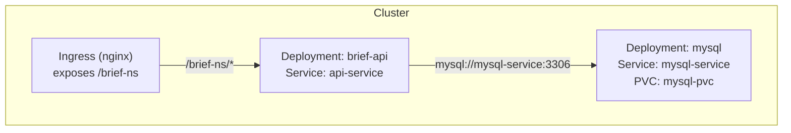

# Kubernetes Backend Deployment 🐳

[](LICENSE)
[](https://www.python.org/)
[](https://www.docker.com/)
[](https://kubernetes.io/)

A small, self-contained project that deploys a Python API and a MySQL database on Kubernetes (local or cloud). The repo includes ready-to-use manifests, a training guide, and helper jobs to initialize and seed the database.

---

## 🚀 Overview

This project demonstrates how to deploy a containerized backend composed of:

- A Python API (FastAPI + Uvicorn)
- A MySQL database with persistent storage
- Kubernetes manifests for Namespace, Secrets, PVC, Deployments, Services, Ingress
- Jobs to initialize and seed the database for testing

Files of interest:

- `docs/brief.md` — original brief and requirements
- `docs/training.md` — step-by-step instructions (local clusters, manifests, tips)
- `manifests/` — all Kubernetes manifests (namespace, secrets, PVC, deployments, services, ingress)

---

## 🏗 Architecture

- The API and MySQL run as separate Deployments.
- MySQL uses a PersistentVolumeClaim to persist data.
- API connects to MySQL via a `ClusterIP` Service (`mysql-service`).
- An Ingress exposes the API under a path prefix (e.g., `/brief-ns`).



---

## ✅ Quick local replication (recommended)

These steps create a local Kubernetes environment, install an ingress controller, deploy the manifests, seed the DB and test endpoints.

Prerequisites (macOS/Linux):

- Docker Desktop (or Docker + kind/minikube)
- kubectl (client)
- helm (for ingress) — optional but recommended

1) Create a local cluster (kind example):

```bash
# install kind if needed
brew install kind
# create cluster
kind create cluster --name brief-cluster
# ensure kubectl uses the kind context
kubectl cluster-info --context kind-brief-cluster
```

2) (Optional) Install nginx ingress (Helm):

```bash
kubectl create namespace ingress-nginx
helm repo add ingress-nginx https://kubernetes.github.io/ingress-nginx
helm repo update
helm install ingress-nginx ingress-nginx/ingress-nginx -n ingress-nginx
kubectl get pods -n ingress-nginx --watch
```

3) Apply manifests (namespace first is included; manifests reference `brief-ns`):

```bash
kubectl apply -f manifests/namespace.yaml
kubectl apply -f manifests/
```

4) Initialize database schema and seed sample data (seed creates 20 clients):

```bash
kubectl apply -f manifests/db-init-job.yaml
kubectl logs -n brief-ns job/db-init-clients
kubectl delete job db-init-clients -n brief-ns

kubectl apply -f manifests/db-seed-job.yaml
kubectl logs -n brief-ns job/db-seed-clients
kubectl delete job db-seed-clients -n brief-ns
```

5) Test API endpoints locally (Service port-forward):

```bash
kubectl port-forward -n brief-ns svc/api-service 8080:80
# then in another terminal
curl http://localhost:8080/health
curl http://localhost:8080/clients
curl -X POST http://localhost:8080/clients -H "Content-Type: application/json" -d '{"first_name":"Ada","last_name":"Lovelace","email":"ada@example.com"}'
```

6) Test via Ingress (port-forward controller locally):

```bash
kubectl -n ingress-nginx port-forward svc/ingress-nginx-controller 8081:80
curl http://localhost:8081/brief-ns/health
curl http://localhost:8081/brief-ns/clients
```

> Note: On cloud clusters, use the Ingress external IP/DNS instead of local port-forward.

---

## 🔧 Common troubleshooting

- Pod crashes / CrashLoopBackOff: `kubectl describe pod -n brief-ns <pod>` and `kubectl logs -n brief-ns <pod>`
- Image pull issues: check `imagePullPolicy` and registry access, or `kind load docker-image <image>` for local images
- Secrets: do not commit plaintext secrets to git. Use `manifests/secret-mysql.yaml` for example and replace values before production.

---

## 🧪 Tests to verify brief requirements

- Health probe: `GET /brief-ns/health` via Ingress or `GET /health` via Service
- CRUD clients: `GET/POST/GET/{id}/DELETE` under `/brief-ns/clients` (test via port-forward or Ingress)

---

## 📁 Repository work tree

```
.
├── README.md
├── Makefile
├── scripts
│   ├── cluster-up.sh        # Create kind cluster, install ingress, deploy manifests, seed DB, run checks
│   ├── cluster-down.sh      # Stop/delete local cluster (kind/docker-desktop)
│   └── full-teardown.sh     # Delete namespace, PVs, ingress; optionally delete cluster
└── manifests
    ├── namespace.yaml
    ├── secret-mysql.yaml
    ├── pvc-mysql.yaml
    ├── mysql-deployment.yaml
    ├── mysql-service.yaml
    ├── api-deployment.yaml
    ├── api-service.yaml
    ├── ingress.yaml
    ├── db-init-job.yaml
    └── db-seed-job.yaml

```

---

## 🛠 Scripts, Makefile & .env (how to run)

This project supports a `.env` file for non-sensitive configuration (cluster name, namespace, ingress namespace). Create a `.env` from the provided template and keep the real `.env` out of Git:

```bash
cp .env.example .env
# edit .env to your needs
```

**Important:** Do not store secrets (passwords) in `.env` if you will commit to a shared repo. Use Kubernetes Secrets instead (`manifests/secret-mysql.yaml`) or use external secret managers for production.

### How scripts load configuration
All shell scripts automatically source `.env` if present and export the values, so you can set `CLUSTER_NAME`, `NAMESPACE`, etc. there instead of editing scripts.


Quick commands (make sure scripts are executable):

```bash
chmod +x scripts/*.sh
```

Using the Makefile (convenient shortcuts):

- Start cluster and deploy everything:

```bash
make up
```

- Start stack but skip installing ingress (if already installed):

```bash
make up-no-ingress
```

- Seed or initialize DB only:

```bash
make init   # runs db-init-job
make seed   # runs db-seed-job (20 sample clients)
```

- Run quick service-level tests (port-forward + curl):

```bash
make test
```

- Stop / delete the local kind cluster:

```bash
make down
```

- Full teardown (delete namespace, PVs, ingress) and cluster removal:

```bash
make teardown
```

- Clean Docker images related to this project:

```bash
# interactive; will ask confirmation
make clean-images
# delete kind node images and prune (be careful)
./scripts/clean-images.sh --delete-kind --prune
```

- Tail API logs:

```bash
make logs
```

These scripts and Makefile targets are designed to let you spin up the entire stack, run the required endpoint checks, and tear everything down when you are done — ideal for short-lived demo runs and grading.

---

## ⚠️ Security & production notes

- Use managed secrets (Vault, SealedSecrets, ExternalSecrets) for production
- Use NetworkPolicies and RBAC to limit access
- Use resource requests/limits and readiness/liveness probes to ensure safe rollouts
